# Lexio

**English for Vietnamese professionals — built on the words they already work with.**

Most vocabulary apps hand you a generic word list. Lexio starts from the email, report, or
specification you actually have to read on Monday: paste it in, and **Gemini** pulls out the
vocabulary, professional phrasing, and grammar worth learning from *your* material. Everything
you keep enters a spaced-repetition schedule, so it comes back exactly when you are about to
forget it.

Built for **AI Riser Vietnam**, on Google technology end to end — Gemini for every AI task,
Firebase Auth and Firestore for cross-device sync, Gmail API for study reminders, and Cloud Run
for hosting, deployed continuously from GitHub Actions.

<table>
<tr>
<td width="50%">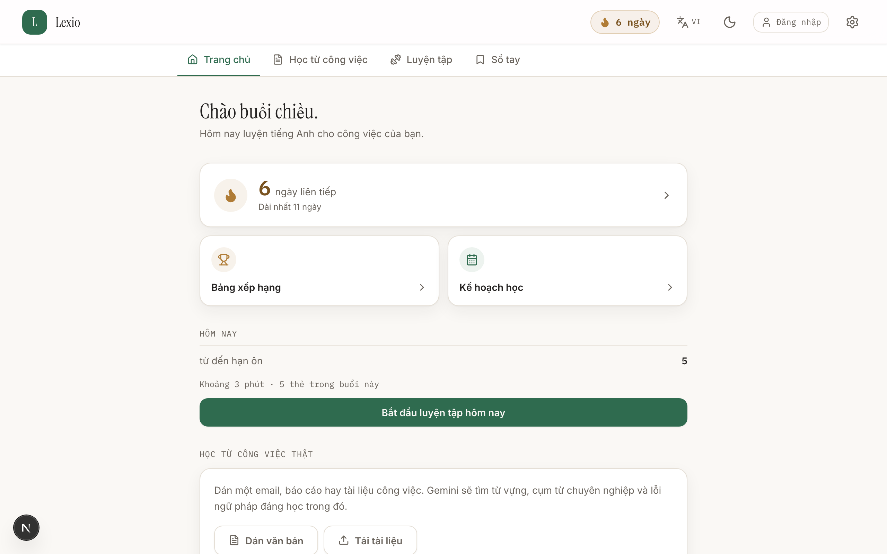</td>
<td width="50%">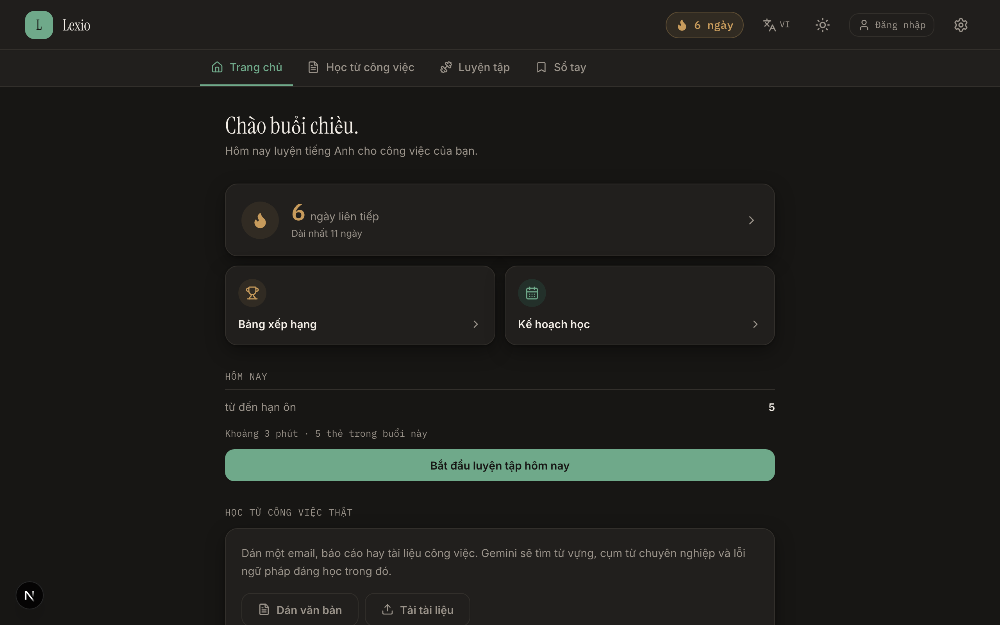</td>
</tr>
</table>

---

## Table of contents

- [Google technology](#google-technology)
- [Feature tour](#feature-tour)
- [Architecture](#architecture)
- [Getting started](#getting-started)
- [Deployment](#deployment)
- [Scripts](#scripts)
- [Project layout](#project-layout)
- [Documentation](#documentation)
- [Project status](#project-status)

---

## Google technology

### Gemini — every AI feature in the product

One `@google/genai` client ([`lib/ai/providers/gemini.ts`](lib/ai/providers/gemini.ts)) powers six
distinct tasks. Models are declared once in [`lib/ai/config.ts`](lib/ai/config.ts):

| | Model |
|---|---|
| Text and structured output | `gemini-3.6-flash` |
| Speech | `gemini-3.1-flash-tts-preview`, voice `Kore` |

| Task | What it does | Route |
|---|---|---|
| `analyzeWork` | Reads a real work email or report → vocabulary, professional phrases, grammar insights, and rewritten sentences | `POST /api/ai/analyze-work` |
| `analyzeDocument` | Mines CEFR-graded vocabulary from an uploaded PDF or DOCX, chunk by chunk | `POST /api/ai/analyze-doc` |
| `extractWords` | Pulls up to 12 worth-learning words out of pasted text | `POST /api/ai/extract` |
| `enrichWord` | Vietnamese meaning, IPA, example sentence, collocations, word family, quiz distractors | `POST /api/ai/enrich` |
| `enrichWordBatch` | The same, batched up to 8 words per call, to keep the notebook topped up in the background | `POST /api/ai/enrich-batch` |
| `gradeSentence` | Grades a sentence the learner wrote, explains the fix in Vietnamese | `POST /api/ai/grade-sentence` |

Three things worth calling out in how Gemini is used:

- **Structured output, not prompt-and-hope.** Every task defines one Zod schema, which is projected
  into Gemini's `responseSchema` — including `propertyOrdering`, so field order in the response
  matches the declaration ([`lib/ai/gemini-schema.ts`](lib/ai/gemini-schema.ts)). The same schema
  validates the reply, and a per-task `repair()` pass trims overlong arrays, de-duplicates, and
  drops distractors that collide with the right answer before anything reaches the client.
- **Text from the user is fenced and labelled as data**, never as instructions — a deliberate guard
  against prompt injection from an uploaded document
  ([`lib/ai/tasks/registry.server.ts`](lib/ai/tasks/registry.server.ts)).
- **Gemini TTS drives the listening exercise.** The API returns raw PCM, which the server wraps in a
  RIFF/WAVE header before it leaves the boundary ([`lib/audio/pcm-to-wav.ts`](lib/audio/pcm-to-wav.ts));
  the browser's own `speechSynthesis` is a three-stage fallback if speech is unavailable.

Gemini is the default provider in code, and the only provider for speech. An OpenAI-compatible
adapter is kept behind the same interface purely as a quota fallback — one Zod schema already
projects to both, so no second schema is maintained by hand.

### Firebase — accounts and cross-device sync

- **Firebase Auth** for email/password sign-in, registration, and password reset
  ([`lib/auth/firebase-auth.ts`](lib/auth/firebase-auth.ts)). Each signed-in account gets its own
  IndexedDB database (`lexio:<uid>`), so two people on one browser never share a notebook.
- **Firestore** backs a two-way sync engine ([`lib/sync/`](lib/sync/)) across five collections plus
  the user profile. It pulls by `updatedAt` cursor in pages of 500, pushes in batched writes, and
  resolves conflicts last-write-wins — except for `words`, which gets a dedicated merge because the
  same word can be created independently on two devices under different ids. A row that fails schema
  validation is quarantined rather than crashing the sync.
- **Firebase Admin SDK** verifies ID tokens server-side to issue the app's own session cookie, using
  Application Default Credentials on Cloud Run.
- Access is enforced by [`firestore.rules`](firestore.rules): a user reads and writes only their own
  document tree, everything else is denied by default.

### Gmail API — study reminders from the learner's own account

OAuth 2.0 with the narrow `gmail.send` scope ([`lib/auth/google.ts`](lib/auth/google.ts)).
`POST /api/gmail/send-reminder` composes a branded HTML digest of due words — IPA, Vietnamese
meaning, example sentence, and a link back into the day's session — and sends it through
`gmail.users.messages.send`. Tokens live in an httpOnly cookie and refresh transparently.

Connecting Gmail deliberately does **not** create an app session: an earlier version let "connect
Gmail" double as "sign in", which meant anyone who connected an account was signed in as that user.

### Cloud Run — hosting, and the bugs that only happen there

The app ships as a multi-stage Docker image on `node:22-bookworm-slim`, running Next.js
`output: 'standalone'` as a non-root user. No secrets are baked at build time; every environment
variable is read per request.

Two production-only failures are fixed in this repo, both worth knowing if you deploy pdf.js on a
serverless runtime:

- **`DOMMatrix is not defined`.** pdf.js constructs a `DOMMatrix` while its module is still
  evaluating, so merely importing it throws on Node. Its self-polyfill loads through
  `createRequire`, which dependency tracing cannot see, so the package never reaches the container.
  Fixed in [`instrumentation.ts`](instrumentation.ts) — the only window early enough, because the
  standalone server evaluates route modules at boot, before the first request.
- **`Setting up fake worker failed`.** `pdf.worker.mjs` is imported by a dynamic specifier and was
  likewise never traced. Named explicitly in `outputFileTracingIncludes`
  ([`next.config.ts`](next.config.ts)).

### CI/CD — GitHub Actions to Cloud Run

[`.github/workflows/ci.yml`](.github/workflows/ci.yml) runs typecheck → lint → tests → build on every
push and pull request, then on `main`:

1. builds the Docker image and pushes it to GHCR;
2. rebuilds into Artifact Registry (reusing the layer cache) and deploys to Cloud Run;
3. smoke-checks the new revision's URL and fails the run if it does not answer.

Authentication is keyless, via **Workload Identity Federation** — no service-account JSON is stored
in the repository. Runtime secrets stay in Cloud Run and are inherited by each new revision, so they
never pass through GitHub. See [Deployment](#deployment) for the one-time setup.

### Google AI Studio

The project was scaffolded in Google AI Studio, and the Firebase project and named Firestore
database are still AI Studio artifacts. The foundations — data layer, AI provider abstraction,
routing, and design system — were rebuilt afterwards; every decision is recorded as an ADR in
[`docs/decision.md`](docs/decision.md).

### Google Fonts

Inter, Instrument Serif, and IBM Plex Mono are self-hosted through `next/font/google`
([`app/fonts.ts`](app/fonts.ts)) with the Vietnamese subset included — no render-blocking round trip
to `fonts.googleapis.com`, and no flash of invisible text on Vietnamese diacritics.

---

## Feature tour

### Learn from your real work

Paste an email or report and Gemini returns vocabulary, professional phrasing, grammar insights, and
improved rewrites. Or upload a PDF/DOCX: the server extracts text with pdf.js/mammoth, splits it into
units, and analyses the chunks in parallel with per-page progress.

<table>
<tr>
<td width="50%">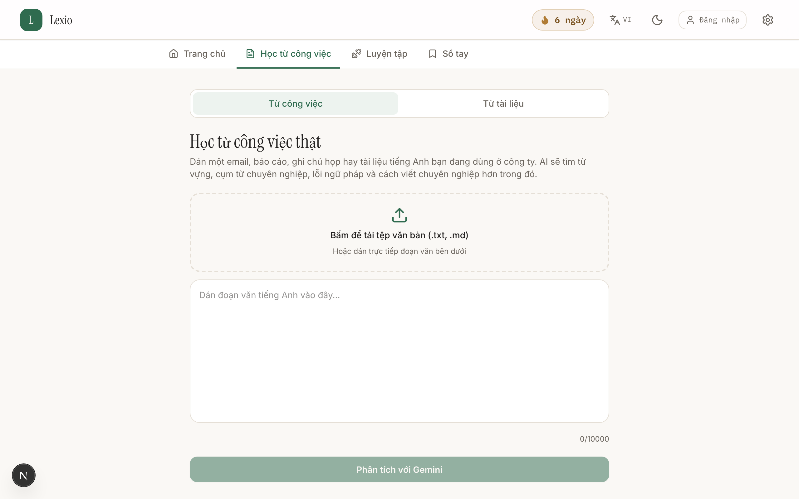</td>
<td width="50%">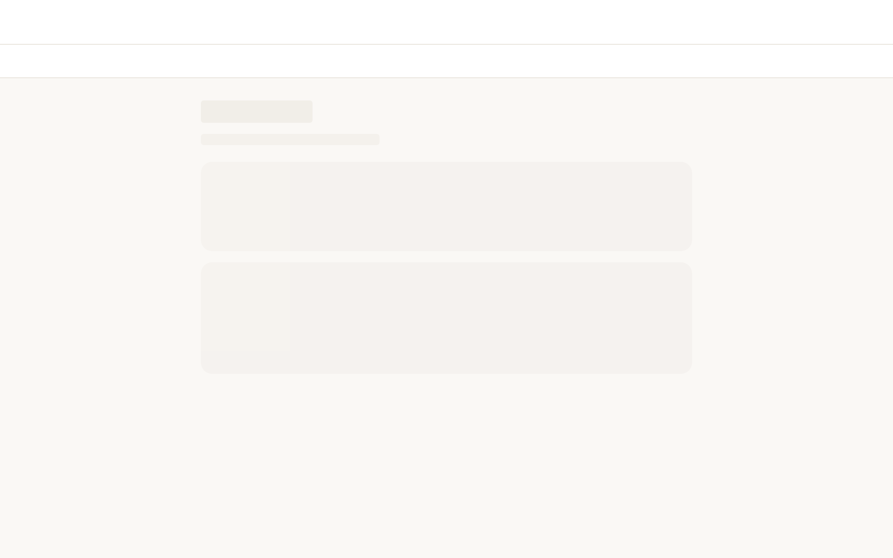</td>
</tr>
</table>

### Practise on a spaced-repetition schedule

Four exercise types — fill in the blank, listen and choose (Gemini TTS), write a sentence (graded by
Gemini), and free recall. The session is frozen when it is created, so counts cannot drift halfway
through.

<table>
<tr>
<td width="50%">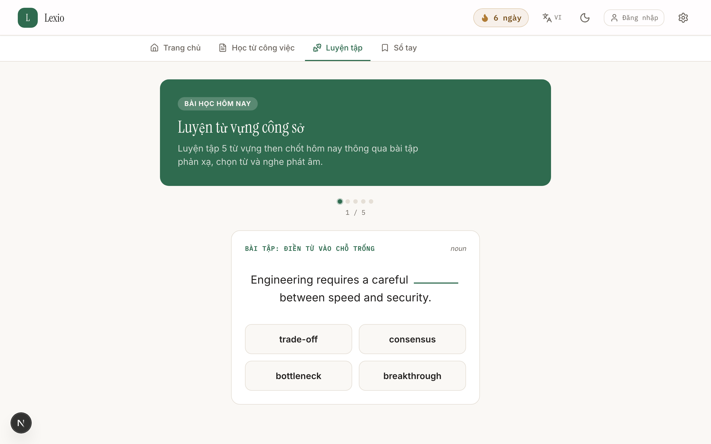</td>
<td width="50%">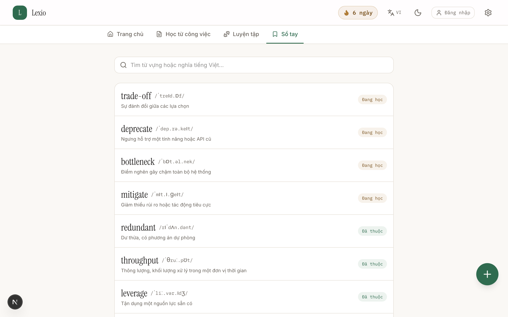</td>
</tr>
</table>

### See progress, keep the streak

<table>
<tr>
<td width="50%">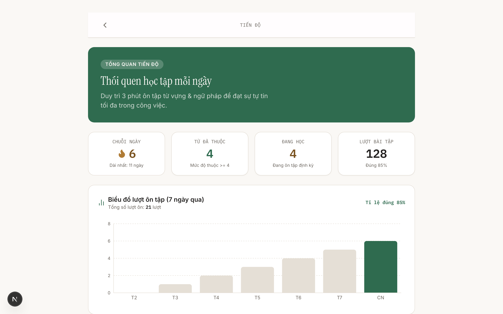</td>
<td width="50%">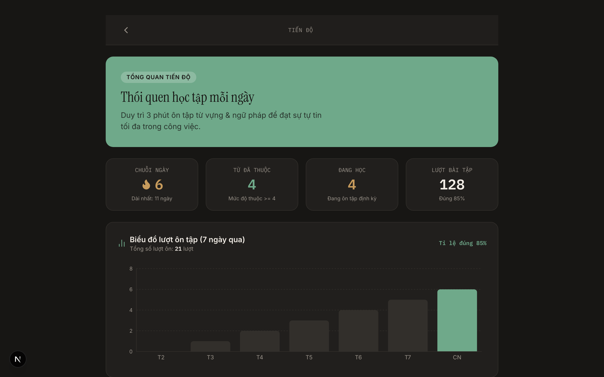</td>
</tr>
</table>

### Start from zero, or from a two-minute placement test

A new notebook is empty by design. The placement test scores 20 words entirely offline against a
local corpus — no AI call, no network — infers a CEFR level, and triages up to eight unknown words
into the notebook.

<table>
<tr>
<td width="50%">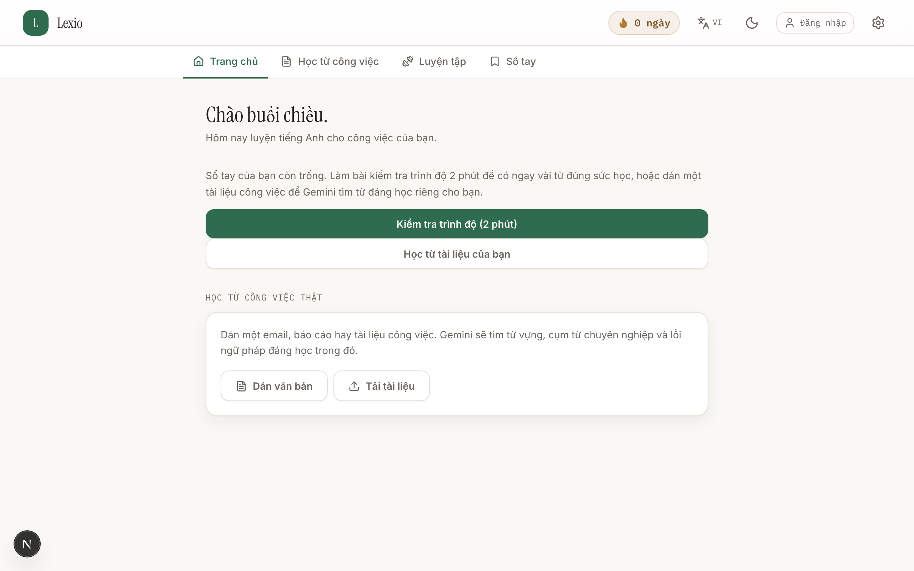</td>
<td width="50%">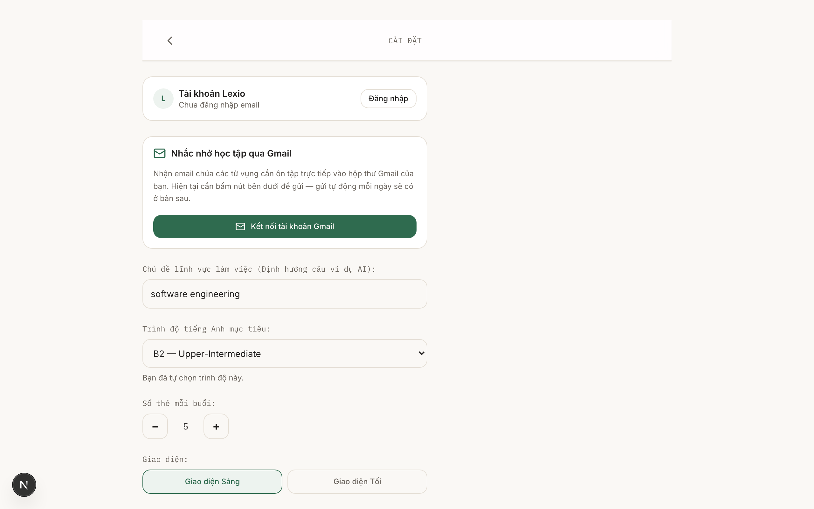</td>
</tr>
</table>

### Phone-first, and a leaderboard

The layout is designed for a phone and adapts upward. The leaderboard ranks you on words learned,
longest streak, and accuracy.

> The other entries on the leaderboard are a fixed sample roster, not real users — only your own row
> is computed from your notebook and review history. Ranking real learners against each other needs
> a server-side aggregate that is out of scope for this build.

<table>
<tr>
<td width="34%">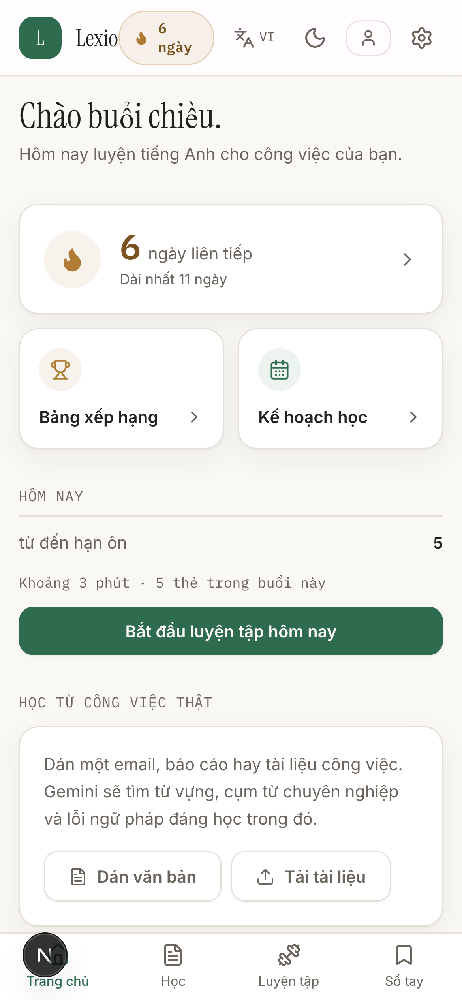</td>
<td width="66%">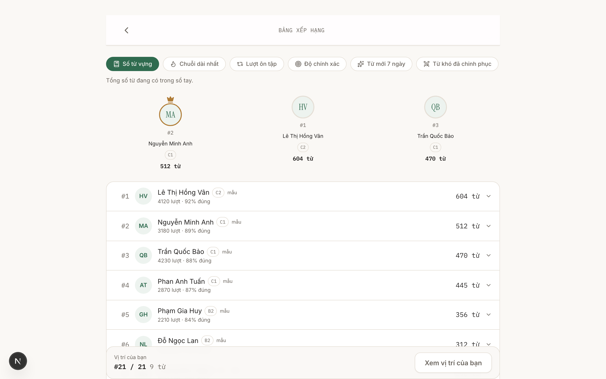</td>
</tr>
</table>

---

## Architecture

- **Next.js 15 App Router.** Every AI call goes through a Route Handler, so no API key ever reaches
  the browser. Each route carries its own timeout, rate limit, body cap, and output-token ceiling.
- **Local-first.** Dexie/IndexedDB is the single source of truth, behind a `Repository` layer that
  components and stores never bypass. The app is fully usable signed out and offline; Firestore is a
  sync layer on top, not the store of record.
- **One schema, many projections.** A Zod schema in `lib/domain/` is the only definition of a shared
  type — it validates database rows, API payloads, and Gemini responses, and generates the provider
  schemas.
- **Pure SRS core.** Scheduling functions never read the system clock; `now` is always a parameter.
  That is what lets the suite run under two timezones and catch drift.
- **Design tokens only.** Colours, radii, and shadows resolve from CSS custom properties, so the
  light/dark toggle re-themes every utility with no re-render. Arbitrary colour values are blocked by
  an ESLint rule.

Full reasoning for each choice — 23 ADRs — is in [`docs/decision.md`](docs/decision.md).

---

## Getting started

```bash
npm ci
cp .env.example .env    # add GEMINI_API_KEY — see the comments in the file
npm run dev             # http://localhost:3000
```

No Firebase project, OAuth client, or any other backend is required to run the app: sign-in, sync,
and Gmail reminders are optional layers. Vocabulary lives in IndexedDB in your browser.

| Variable | Needed for |
|---|---|
| `GEMINI_API_KEY` | All AI features and text-to-speech |
| `APP_URL` | OAuth redirects — must match the deployed origin |
| `GOOGLE_CLIENT_ID` / `GOOGLE_CLIENT_SECRET` | Gmail reminders |
| `FIREBASE_ADMIN_*` | Server-side session cookies (Cloud Run uses ADC instead) |

---

## Deployment

Deployment to Cloud Run is automatic on every push to `main` once the repository is configured. The
`deploy` job skips itself entirely until then, so a fresh clone or a fork still gets a green CI.

**Repository variables:** `GCP_PROJECT_ID`, `GCP_REGION`, `GCP_SERVICE`, `GCP_AR_REPOSITORY`
**Repository secrets:** `GCP_WORKLOAD_IDENTITY_PROVIDER`, `GCP_SERVICE_ACCOUNT`

One-time Google Cloud setup:

```bash
PROJECT_ID=your-project-id
REGION=asia-southeast1
REPO=your-github-org/your-repo

# Artifact Registry repository for the image
gcloud artifacts repositories create lexio \
  --repository-format=docker --location="$REGION" --project="$PROJECT_ID"

# A deploy identity GitHub will impersonate
gcloud iam service-accounts create github-deployer --project="$PROJECT_ID"
SA="github-deployer@${PROJECT_ID}.iam.gserviceaccount.com"
for ROLE in roles/run.admin roles/artifactregistry.writer roles/iam.serviceAccountUser; do
  gcloud projects add-iam-policy-binding "$PROJECT_ID" --member="serviceAccount:${SA}" --role="$ROLE"
done

# Workload Identity Federation — GitHub authenticates with a short-lived OIDC token,
# so there is no long-lived key to store or rotate.
gcloud iam workload-identity-pools create github --location=global --project="$PROJECT_ID"
gcloud iam workload-identity-pools providers create-oidc github \
  --location=global --workload-identity-pool=github \
  --issuer-uri=https://token.actions.githubusercontent.com \
  --attribute-mapping=google.subject=assertion.sub,attribute.repository=assertion.repository \
  --attribute-condition="assertion.repository=='${REPO}'" --project="$PROJECT_ID"
gcloud iam service-accounts add-iam-policy-binding "$SA" \
  --role=roles/iam.workloadIdentityUser --project="$PROJECT_ID" \
  --member="principalSet://iam.googleapis.com/projects/$(gcloud projects describe "$PROJECT_ID" --format='value(projectNumber)')/locations/global/workloadIdentityPools/github/attribute.repository/${REPO}"
```

Runtime configuration (`GEMINI_API_KEY`, `AI_PROVIDER`, `GOOGLE_CLIENT_*`, `APP_URL`) is set on the
Cloud Run service itself, ideally through Secret Manager. The workflow never sends environment
variables, so each new revision inherits the previous one's configuration.

---

## Scripts

| Command | What it does |
|---|---|
| `npm run dev` | Development server with hot reload |
| `npm run build` | Production build — typechecks and prerenders every route |
| `npm start` | Serve the production build |
| `npm run lint` | ESLint (flat config) |
| `npm run typecheck` | `tsc --noEmit` |
| `npm test` | Vitest, run twice under `TZ=UTC` and `TZ=America/New_York` |
| `npm run test:watch` | Tests in watch mode |
| `npm run format` | Prettier, write mode |

Regenerating the README screenshots (needs a dev server running):

```bash
node scripts/capture-screenshots.mjs
```

---

## Project layout

```
app/(tabs)/          today, learn, practice, vocabulary
app/(stack)/         progress, settings, leaderboard, calendar, grammar, placement, login
app/api/ai/          7 Gemini routes
app/api/parse-doc/   PDF/DOCX text extraction
app/api/gmail/       Gmail reminder sender
app/api/auth/        Firebase session + Google OAuth
instrumentation.ts   server bootstrap — pdf.js DOMMatrix polyfill
lib/domain/          Zod schemas — the single definition of every shared type
lib/ai/              provider abstraction, schema adapters, task registry
lib/db/              Dexie schema, migrations, safe reads
lib/repositories/    data access layer
lib/sync/            two-way Firestore sync engine
lib/srs/             scheduling, streaks, session builder (pure, tested)
lib/firebase/        client and admin SDK setup
lib/auth/            Firebase Auth and Google OAuth
components/          shared UI and exercise components
docs/                architecture, ADRs, API contracts, progress
```

---

## Documentation

Start at [`docs/README.md`](docs/README.md). Highlights:

- [`docs/decision.md`](docs/decision.md) — 23 ADRs: what was chosen, and what it was chosen over.
- [`docs/architecture.md`](docs/architecture.md) — how the layers fit together.
- [`docs/api_document.md`](docs/api_document.md) — contract for every route.
- [`docs/data-model.md`](docs/data-model.md) — entities, Dexie schema, migration strategy.
- [`docs/progress/board.md`](docs/progress/board.md) — phase-by-phase status.

---

## Project status

Working end to end: the notebook and SRS engine, all six Gemini tasks, Gemini TTS, PDF/DOCX ingestion,
Firebase Auth, two-way Firestore sync, Gmail reminders, the offline placement test, progress and
grammar screens, Vietnamese/English UI, and light/dark themes.

Known gaps, stated plainly:

- **Google Sign-In is implemented but disabled** behind a flag — it stalls on the Firebase auth
  handler, most likely a missing authorized redirect URI. Email/password sign-in is the working path.
- **The leaderboard roster is sample data.** Only your own row is real.
- **Seven migration tests are failing** (`lib/db/__tests__/migrations.test.ts`), counted twice by the
  two-timezone runner. They are unrelated to the AI, sync, and document paths, but the suite is red
  and this README will not pretend otherwise.
- Reminder scheduling is manual — there is no Cloud Scheduler job; the learner triggers the email.

See [`docs/progress/board.md`](docs/progress/board.md) for the full picture.
