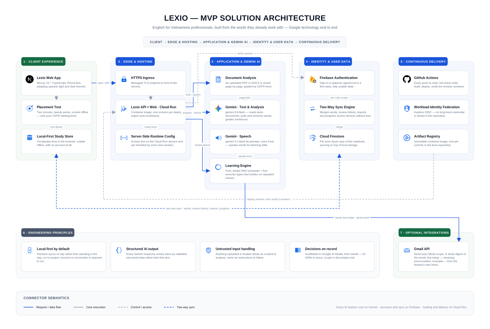

# Lexio

**English for Vietnamese professionals — built from the words they already work with.**

Most vocabulary apps hand you a generic word list. Lexio starts from the email, report, or
specification you actually have to read on Monday: paste it in, and **Gemini** pulls out the
vocabulary, professional phrasing, and grammar worth learning from *your* material. Everything you
keep enters a spaced-repetition schedule, so it comes back exactly when you are about to forget it.

Built for **AI Riser Vietnam**, on Google technology end to end — Gemini for every AI feature,
Firebase for accounts and cross-device sync, Gmail for study reminders, and Cloud Run for hosting,
deployed continuously from GitHub Actions.

<table>
<tr>
<td width="50%"></td>
<td width="50%"></td>
</tr>
</table>

---

## The problem

Vietnamese professionals do not struggle with English in general. They struggle with the English in
front of them — the client email, the release note, the specification. Generic word lists do not
cover it, and a word learned out of context is forgotten within a week.

Lexio takes the opposite route: your own material is the syllabus, and the schedule makes it stick.

---

## Built on Google

### Gemini — every AI feature in the product

| | |
|---|---|
| **Text and analysis** | `gemini-3.6-flash` |
| **Speech** | `gemini-3.1-flash-tts-preview`, voice `Kore` |

Gemini does six jobs in Lexio:

- **Reads your work document** — an email or report becomes vocabulary, professional phrases,
  grammar insights, and better-written versions of your own sentences.
- **Mines an uploaded PDF or DOCX** for vocabulary graded by CEFR level, page by page.
- **Pulls the words worth learning** out of any text you paste.
- **Enriches each word** with a Vietnamese meaning, IPA, an example sentence, collocations, word
  family, and quiz options — in the background, so the notebook is always ready.
- **Grades sentences you write**, and explains the correction in Vietnamese.
- **Speaks the words aloud** for the listening exercise, through Gemini's text-to-speech.

Every response comes back as validated structured data rather than free text, and anything you
upload is treated strictly as content to analyse, never as instructions to follow.

### Firebase — accounts and cross-device sync

Sign in and your notebook follows you. A two-way sync engine keeps words, review history, imports,
and progress consistent across devices, merging changes made on two phones without losing either.
Guest mode is a first-class state: everything is stored locally and the app keeps working offline,
without ever creating an account.

### Gmail — reminders from your own inbox

Connect Gmail and Lexio sends you a study digest of the words due today — meaning, pronunciation,
example sentence, and a link straight into the session. It sends through your own account, using
send-only permission.

### Cloud Run — hosting and continuous delivery

Every push to `main` runs the full check suite, builds a container, deploys it to Cloud Run, and
verifies the new revision answers before the run is marked green. Authentication to Google Cloud is
keyless, so no long-lived credentials are stored anywhere in the repository.

### Google AI Studio

The project was scaffolded in Google AI Studio and grew from there — the foundations were rebuilt
afterwards, with every significant decision written down as an architecture decision record.

---

## Feature tour

### Learn from your real work

Paste an email or report and get back vocabulary, professional phrasing, grammar notes, and improved
rewrites. Or upload a PDF or DOCX and let it be analysed page by page.

<table>
<tr>
<td width="50%"></td>
<td width="50%"></td>
</tr>
</table>

### Practise on a spaced-repetition schedule

Four exercise types: fill in the blank, listen and choose, write a sentence, and free recall. Words
you keep getting wrong switch automatically to harder formats until they stick.

<table>
<tr>
<td width="50%"></td>
<td width="50%"></td>
</tr>
</table>

### Watch progress build

Streaks, words mastered, accuracy, and a seven-day review chart.

<table>
<tr>
<td width="50%"></td>
<td width="50%"></td>
</tr>
</table>

### Start in two minutes

A new notebook is empty on purpose. A two-minute placement test scores twenty words offline, works
out your CEFR level, and puts the right first words in your notebook.

<table>
<tr>
<td width="50%"></td>
<td width="50%"></td>
</tr>
</table>

### Phone-first, with a leaderboard

Designed for a phone and adapting upward, in light and dark themes. The leaderboard ranks you by
words learned, longest streak, and accuracy.

> The leaderboard is real: every signed-in learner publishes an aggregate row to a shared
> `leaderboard/{uid}` Firestore collection after each sync, and the board shows the 200 most recently
> active learners. Only aggregate numbers are published — never your notebook or your email — and
> `firestore.rules` enforces that with a field whitelist. Guests and signed-out visitors see their
> own row only.

<table>
<tr>
<td width="34%"></td>
<td width="66%"></td>
</tr>
</table>

---

## Getting started

```bash
npm ci
cp .env.example .env    # add GEMINI_API_KEY — see the comments in the file
npm run dev             # http://localhost:3000
```

That is the whole setup. Your vocabulary lives in the browser, so the app works offline once you are
in. The app asks for a login, with a "try it without an account" button on the login screen for
anyone who just wants to look around — guest mode learns and practises normally, but stays off the
leaderboard, cannot upload documents, and does not sync across devices.

Gemini is the default AI provider; `AI_PROVIDER=openai` switches to the OpenAI-compatible fallback
(`docs/decision.md` ADR-012). A Firebase project and OAuth client are only needed for accounts,
sync, and Gmail reminders.

### Seeing every feature in one run

```bash
npm run dev            # in another terminal (npm run start works too)
npm run demo           # drives the whole product, writes screenshots to UI/demo/
npm run demo -- --list                       # what each scene covers
npm run demo -- --headed --slow=250          # watch it happen
npm run demo -- --only=learn-doc,practice    # just these scenes
```

`scripts/demo-features.mjs` walks a browser through every feature the way a user would — placement
test, learning from a work email, mining a document, all four exercise types, the notebook, progress,
leaderboard, grammar, settings, dark mode and the phone layout — asserting what should be on screen
at each step and printing a pass/fail summary. Every `/api/ai/*` call is answered from a fixture
table, so it needs no `GEMINI_API_KEY`, costs nothing, and gives the same result every run.

---

## Deployment

Cloud Run deployment is automatic on every push to `main`, and stays switched off until the
repository is configured — so a fresh clone or a fork still gets a green build.

Add these to the repository, then push:

| | |
|---|---|
| **Variables** | `GCP_PROJECT_ID`, `GCP_REGION`, `GCP_SERVICE`, `GCP_AR_REPOSITORY` |
| **Secrets** | `GCP_WORKLOAD_IDENTITY_PROVIDER`, `GCP_SERVICE_ACCOUNT` |

<details>
<summary>One-time Google Cloud setup</summary>

```bash
PROJECT_ID=your-project-id
REGION=asia-southeast1
REPO=your-github-org/your-repo

# Artifact Registry repository for the image
gcloud artifacts repositories create lexio \
  --repository-format=docker --location="$REGION" --project="$PROJECT_ID"

# A deploy identity for GitHub to impersonate
gcloud iam service-accounts create github-deployer --project="$PROJECT_ID"
SA="github-deployer@${PROJECT_ID}.iam.gserviceaccount.com"
for ROLE in roles/run.admin roles/artifactregistry.writer roles/iam.serviceAccountUser; do
  gcloud projects add-iam-policy-binding "$PROJECT_ID" --member="serviceAccount:${SA}" --role="$ROLE"
done

# Workload Identity Federation — GitHub authenticates with a short-lived token,
# so there is no long-lived key to store or rotate.
gcloud iam workload-identity-pools create github --location=global --project="$PROJECT_ID"
gcloud iam workload-identity-pools providers create-oidc github \
  --location=global --workload-identity-pool=github \
  --issuer-uri=https://token.actions.githubusercontent.com \
  --attribute-mapping=google.subject=assertion.sub,attribute.repository=assertion.repository \
  --attribute-condition="assertion.repository=='${REPO}'" --project="$PROJECT_ID"
gcloud iam service-accounts add-iam-policy-binding "$SA" \
  --role=roles/iam.workloadIdentityUser --project="$PROJECT_ID" \
  --member="principalSet://iam.googleapis.com/projects/$(gcloud projects describe "$PROJECT_ID" --format='value(projectNumber)')/locations/global/workloadIdentityPools/github/attribute.repository/${REPO}"
```

</details>

API keys and other runtime settings live on the Cloud Run service itself and are inherited by each
new revision, so they never pass through GitHub.

---

## Architecture



The product is one Next.js application on Cloud Run, with Gemini behind every AI feature and Firebase
holding the parts that have to follow you between devices. Read the diagram left to right:

**1 · Client experience.** A Next.js 15 + TypeScript web app, designed for a phone and adapting
upward, in light and dark themes. A two-minute placement test scores twenty words offline and sets
your CEFR starting level. Vocabulary lives in the browser — usable offline, with no account at all.

**2 · Edge and hosting.** A managed TLS endpoint in front of the Cloud Run service in
`asia-southeast1`, one revision per deploy. AI keys live on the service itself and are inherited by
each new revision, so the browser never sees one and no key passes through GitHub.

**3 · Application and Gemini AI.** The server side does four jobs: mining an uploaded PDF or DOCX
page by page and grading it by CEFR level; `gemini-3.6-flash` for reading work documents, pulling and
enriching words, and grading sentences; `gemini-3.1-flash-tts-preview` (voice `Kore`) for the
listening drills; and the learning engine — a pure, tested spaced-repetition scheduler with four
exercise types that harden on repeated misses.

**4 · Identity and user data.** Firebase Authentication, where signing in is optional and signed-out
is a first-class, fully usable state. When you do sign in, a two-way sync engine merges words, review
history, imports, and progress across devices without losing either side, and Cloud Firestore keeps a
per-user copy of the notebook on top of local storage.

**5 · Continuous delivery.** Every push to `main` runs the full check suite, builds an immutable
image into Artifact Registry, deploys it, and verifies the new revision answers before the run goes
green. GitHub authenticates through Workload Identity Federation — keyless OIDC, so there is no
long-lived credential in the repository.

**Optional integration.** Connect Gmail and the words due today are sent to you as a study digest
from your own inbox, using a send-only OAuth scope.

Four principles hold the design together: local-first by default, so Firestore syncs on top rather
than standing in the way; structured AI output, so every Gemini response comes back as validated data
rather than free text; untrusted input handling, so anything uploaded is treated strictly as content
to analyse, never as instructions to follow; and decisions on record — 26 architecture decision
records in [`docs/`](docs/README.md), with what is finished and what is not in
[`docs/status.md`](docs/status.md).
